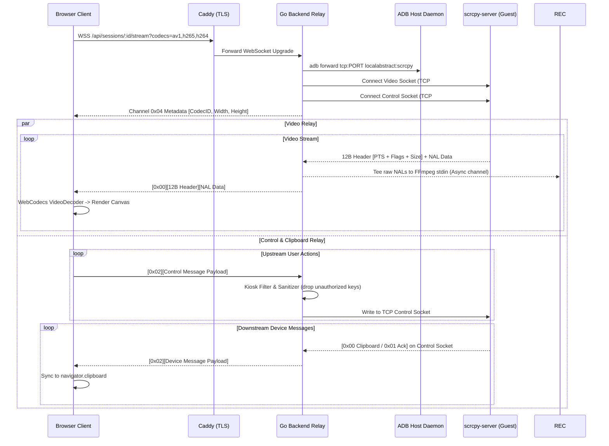
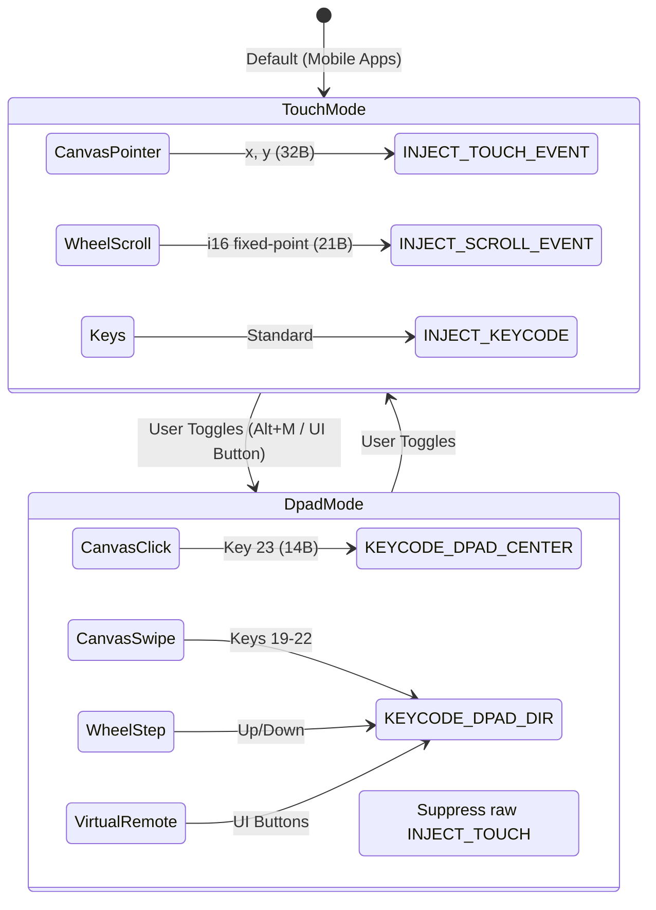
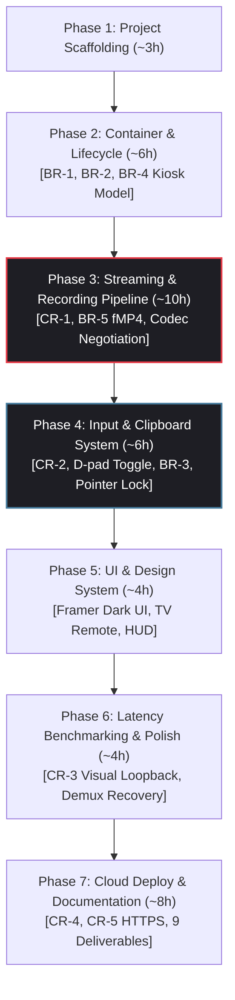

# Implementation Plan: HealthTick Real-Time Android Browser Streaming

## Goal Description

Build an enterprise-grade, full-stack web application that streams a live, interactive Android device to a browser within a 72-hour deadline. Users open a public HTTPS URL, see a real Android 13 screen updating in real-time via WebCodecs `VideoDecoder`, and interact with it using mouse/touch/D-pad and keyboard. Each user gets an isolated, ephemeral `redroid` container orchestrated by a Go backend following Clean Architecture.

### System Architecture Overview

```mermaid
flowchart LR
    subgraph "Cloud VM · Ubuntu 22.04/24.04"
        subgraph "Per-Session Container (redroid)"
            RED["redroid:13.0.0\n(Android 13 ART)"]
            SCR["scrcpy-server v2.7\n(Capture & Control)"]
            DPC["Headless DPC Helper\n(Lock Task Mode)"]
        end
        ADB["ADB TCP Port Pool\n(:5555-:5557)"]
        
        subgraph "Go Backend Service (Clean Architecture)"
            API["API Gateway / Controllers\n(Gin HTTP + WS Upgrade)"]
            UC["Use Cases\n(Session, Stream Relay, Kiosk, Watchdog)"]
            REC["FFmpeg Recorder Worker\n(Stream Copy fMP4 Pipe)"]
            INFRA["Infrastructure Adapters\n(Docker SDK, ADB, Scrcpy, PortPool)"]
            SQL[(SQLite Metadata)]
        end
        
        CAD["Caddy Reverse Proxy\n(Auto Let's Encrypt HTTPS / WSS)"]
    end

    subgraph "Browser Client (Presentation Layer Only)"
        REACT["React 18 + Vite SPA\n(Framer Dark UI)"]
        DEMUX["Resilient WS Demuxer\n(Channel 0x00..0x04)"]
        WC["WebCodecs VideoDecoder\n(Codec Factory: H.264/H.265/AV1)"]
        CANVAS["HTML5 Canvas\n(desynchronized 2D)"]
        INPUT["Input System\n(Touch, D-pad, Pointer Lock, Clipboard)"]
    end

    RED <-->|"Screen Buffer / Input"| SCR
    SCR -->|"Video Socket (Annex B NAL)"| ADB
    SCR <-->|"Control Socket (Binary Protocol)"| ADB
    ADB <-->|"TCP Forward"| INFRA
    INFRA <--> UC
    UC -->|"Raw NAL Tee (Non-blocking)"| REC
    UC <--> API
    API <-->|"WSS Multiplex:\n0x00=Video, 0x02=Control\n0x03=Ping, 0x04=Metadata"| CAD
    API --- SQL
    CAD <-->|"HTTPS / WSS"| REACT
    REACT --> DEMUX
    DEMUX -->|"0x00 Video"| WC --> CANVAS
    DEMUX <-->|"0x02 Device Msg / Clipboard"| INPUT
    INPUT -.->|"User Actions"| DEMUX
```



---

### Requirements Coverage Matrix

| Requirement | Priority | PRD Section | Phase | Selected Best Approach & Architecture |
|:---|:---:|:---:|:---:|:---|
| **CR-1: Continuous Real-Time Streaming** | **Must** | §3 FR-1 | 3 | scrcpy v2.7 Annex B NALs → WS binary relay → WebCodecs VideoDecoder. Codec-agnostic design with runtime negotiation (H.264 Baseline floor, H.265, AV1). |
| **CR-2: Normalized Input Forwarding** | **Must** | §3 FR-2 | 4 | `getBoundingClientRect()` normalized coordinates (0.0–1.0) → i16-fixed-point scroll → scrcpy binary control messages (`INJECT_TOUCH_EVENT`, `INJECT_SCROLL_EVENT`). |
| **CR-2 Senior: D-pad vs. Touch Mode Toggle** | **Must (Senior)** | §3 FR-2 | 4, 5 | Segmented UI toggle + Virtual TV Remote. In D-pad mode, raw touch is suppressed to prevent Android Touch Mode flapping (`isInTouchMode=false`); navigation emits `KEYCODE_DPAD_*` (19–23). |
| **CR-3: Latency Measurement** | **Must** | §3 FR-3 | 6 | Standardized Visual Loopback test (sub-millisecond clock rendered in Android vs. canvas capture) + real-time glass-to-glass Latency HUD overlay. |
| **CR-4: Reproducible Execution** | **Must** | §3 FR-4 | 1, 7 | Single-machine automated orchestration via `docker-compose.yml`, `setup-vm.sh`, kernel binder loading, and documented verification scripts. |
| **CR-5: Public Deployed HTTPS Link** | **Must** | §3 FR-5 | 7 | Public Cloud VM deployment fronted by Caddy for auto-TLS (Let's Encrypt), satisfying WebCodecs Secure Context requirements. |
| **BR-1: Isolated Instance per User** | **Bonus** | §4 BR-1 | 2 | Per-session ephemeral redroid container via Go Docker SDK, isolated bridge network, dedicated ADB port, zero cross-session state leakage. |
| **BR-2: On-Demand Lifecycle Management** | **Bonus** | §4 BR-2 | 2 | Ephemeral container boot on handshake/POST, heartbeat tracking, auto-termination on idle timeout (15 min) or disconnect with immediate resource reclamation. |
| **BR-3: Two-Way Clipboard Synchronization** | **Bonus** | §4 BR-3 | 4 | Native scrcpy bidirectional control protocol (`SET_CLIPBOARD` 0x09 + `DEVICE_MSG_TYPE_CLIPBOARD` 0x00) with browser Clipboard API, echo loop suppression, and XSS sanitization. |
| **BR-4: Kiosk Mode Enforcement** | **Bonus** | §4 BR-4 | 2, 4 | 3-Tier Defense-in-Depth: (1) Server-side Go control keycode filter (`HOME`, `RECENTS`, `POWER` dropped), (2) Android Lock Task Mode / immersive policy, (3) Go activity watchdog daemon. |
| **BR-5: Automated Session Recording** | **Bonus** | §4 BR-5 | 3 | Go non-blocking stream tee → FFmpeg stdin pipe remuxing raw Annex B NALs to Fragmented MP4 (`-c:v copy -movflags frag_keyframe+empty_moov+default_base_moof`) tied to Session ID. |
| **Senior Edge Case: Pointer Lock API** | **Quality** | §7 | 4 | `requestPointerLock()` for relative mouse delta control with virtual cursor state machine; suppresses `KEYCODE_BACK` on `Escape` key when locked. |
| **Senior Edge Case: Special Characters** | **Quality** | §7 | 4 | Binary `INJECT_TEXT` (0x01) UTF-8 injection for `'`, `&`, emojis, and unicode symbols; completely bypasses shell command injection risks. Empty search guarded. |
| **Senior Edge Case: Resilient Demuxing** | **Quality** | §7 | 3, 4 | Length-bounded framing (16MB cap), corrupted packet drop, IDR keyframe resynchronization, and automatic `VideoDecoder` crash recreation circuit breaker. |
| **AI Compliance: Pivot Decisions & Audit** | **Compliance** | §5 | Ongoing | Append-only `PROCESS_LOG.md` recording verbatim prompts, timestamps, suboptimal AI suggestions, architectural pivot rationale, and human vs. AI contribution matrix. |

---

## Resolved Technical Decisions & Industry Best Practices

| Domain | Selected Decision | Evaluated Alternatives | Rationale & Trade-off Analysis |
|:---|:---|:---|:---|
| **Backend Architecture** | **Go 1.22+ Clean Architecture** | Node.js, Python, Rust | Go provides sub-millisecond goroutine scheduling, zero GC stalls for byte relaying, memory efficiency for 50+ concurrent sessions, and strict Clean Architecture layer separation. |
| **Screen Streaming Pipeline** | **scrcpy-server v2.7 → TCP Forward → Go WS Relay → WebCodecs** | WebRTC (Pion/GStreamer), VNC/RFB, MJPEG | Direct H.264 Annex B pass-through via WebCodecs delivers sub-30ms glass-to-glass latency with zero server transcoding overhead. Avoids WebRTC SDP signaling complexity in 72h window. |
| **Codec Strategy** | **Codec-Agnostic with Capability Negotiation** | Fixed H.264 only | Browser probes `VideoDecoder.isConfigSupported()`, sends preferences in WS URL (`?codecs=av1,h265,h264`); Go selects optimal codec, sends Channel `0x04` metadata, and instantiates codec handler. |
| **D-pad vs. Touch Interaction** | **Hybrid Protocol & Virtual TV Remote** | Raw Touch only, CLI ADB only | Prevents the Android "Touch Mode Flapping" bug where touch events strip visual focus rings on Android TV/Leanback apps. Suppresses touch in D-pad mode, emitting `KEYCODE_DPAD_*`. |
| **Clipboard Sync** | **Native scrcpy Bidirectional Control** | `STFService.apk`, ADB shell commands | `STFService.apk` is broken on Android 10+ background apps. scrcpy runs via `app_process` (UID 2000), accessing `IClipboard` directly. Zero extra APKs, sub-millisecond sync. |
| **Kiosk Mode** | **3-Tier Defense-in-Depth** | Browser-only blocking, Screen pinning | Browser-only controls are easily bypassed via DevTools/custom WS clients. 3 tiers: Go server keycode/edge filter + AOSP Lock Task Mode + Go background activity guardian watchdog. |
| **Session Recording** | **FFmpeg Pipe Stream Copy (Fragmented MP4)** | Pure Go muxers (`gomedia`), raw `.h264`, Android `screenrecord` | Near-zero CPU (<1%), zero transcoding (`-c:v copy`), crash-safe fragmented MP4 (`moof` atoms), immediately playable in web browsers via `<video>`. |
| **Mouse Control** | **Dual-Mode: Absolute + Pointer Lock** | Absolute mouse only | Absolute coordinates are standard for touch apps; Pointer Lock is enabled via UI toggle for 3D games and relative cursor control with virtual cursor state machine. |
| **Frontend Framework** | **React 18 + Vite + TypeScript + Tailwind** | Next.js, Vue, Vanilla JS | Rapid SPA development, zero SSR overhead for canvas streaming, strict typing for binary packet structures, Framer dark theme design system. |
| **TLS & Reverse Proxy** | **Caddy v2** | Nginx, Traefik, Cloudflare Tunnel | Automatic zero-config Let's Encrypt SSL/TLS certificates; required for WebCodecs Secure Context (`window.isSecureContext === true`). |

---

## In-Depth Architectural & Protocol Specifications

### 1. scrcpy-server Connection Flow & Multiplexing

The system utilizes a single full-duplex WebSocket connection between browser and Go backend. Packets are framed with a **1-byte channel prefix**:
- `0x00`: Video Frame (scrcpy 12-byte header + raw NAL payload)
- `0x01`: Audio Frame (Reserved for future extension)
- `0x02`: Control / Device Message (Bidirectional touch, keys, clipboard)
- `0x03`: Ping / Pong / Latency probe
- `0x04`: Stream Metadata & Codec Negotiation Handshake



---

### 2. Codec-Agnostic Design & Capability Negotiation

To satisfy **FR-1** ("codec-agnostic, designed to support modern encoders like H.265 or AV1"), scrcpy-server v2.7 supports `video_codec=h264`, `h265`, and `av1`. The 12-byte packet header is invariant across all video codecs:

```
┌────────────────────────────────────────────────────────────┐
│                  pts_and_flags (8 bytes BE)                │
│  Bit 63: PACKET_FLAG_CONFIG (SPS/PPS, VPS, Sequence Header)│
│  Bit 62: PACKET_FLAG_KEY_FRAME (IDR slice / Key OBU)       │
│  Bits 0-61: PTS in microseconds                           │
├────────────────────────────────────────────────────────────┤
│                  packet_size (4 bytes BE)                  │
├────────────────────────────────────────────────────────────┤
│                  Raw Codec Bitstream Data                  │
│       H.264/H.265: Annex B NALs (00 00 00 01 start code)   │
│       AV1: Low-overhead OBU sequence                       │
└────────────────────────────────────────────────────────────┘
```

#### Negotiation Sequence:
1. **Client Probe**: During initialization, frontend calls `VideoDecoder.isConfigSupported()` for:
   - `av01.0.05M.08` (AV1 Main Level 3.1)
   - `hev1.1.6.L93.B0` (HEVC/H.265 Main Level 3.1)
   - `avc1.42e01f` (H.264 Constrained Baseline Level 3.1)
2. **Handshake Query**: Client appends supported list to WebSocket URL: `?codecs=av1,h265,h264`.
3. **Backend Selection**: `domain.NegotiateCodec(requested, allowed)` matches against container capabilities.
4. **scrcpy Launch**: Injects `video_codec=<chosen_codec>` into the server launch arguments.
5. **Metadata Channel (`0x04`)**:
   ```
   [0x04 : 1B Channel]
   [0x01 | 0x02 | 0x03 : 1B Wire Codec ID (1=H264, 2=H265, 3=AV1)]
   [width : 2B uint16 BE]
   [height : 2B uint16 BE]
   ```
6. **Frontend Codec Factory**: Dynamically assigns the corresponding `CodecHandler` strategy, ensuring zero changes to the underlying WebCodecs frame loop.

---

### 3. D-pad vs. Touch Interaction Model (FR-2 Senior Requirement)

#### The Touch Mode Problem:
Android's `ViewRootImpl` manages `isInTouchMode`. When touch events arrive, Android enters Touch Mode and **strips all focus outlines** from views. In Android TV / Leanback applications (`BrowseSupportFragment`, `VerticalGridView`), clicking with mouse touch coordinates breaks focus and halts navigation.

#### The Solution:
Provide an explicit **D-pad / Touch Mode Toggle** in the web UI.



- **Android D-pad Keycodes**:
  - `KEYCODE_DPAD_UP` = 19 (`0x13`)
  - `KEYCODE_DPAD_DOWN` = 20 (`0x14`)
  - `KEYCODE_DPAD_LEFT` = 21 (`0x15`)
  - `KEYCODE_DPAD_RIGHT` = 22 (`0x16`)
  - `KEYCODE_DPAD_CENTER` = 23 (`0x17`)
- **Backend Defense-in-Depth**: In D-pad mode, Go `StreamRelay` discards any stray `INJECT_TOUCH_EVENT` packets, ensuring the Android container never flaps into Touch Mode.

---

### 4. Two-Way Clipboard Synchronization (BR-3)

Uses scrcpy-server's native binary protocol over the control socket (UID 2000 `app_process`), bypassing Android 10+ background clipboard restrictions:

1. **Host-to-Device (Browser → Android)**:
   - User triggers native browser paste (`Ctrl+V` / `Cmd+V`) or clicks toolbar Paste.
   - Client sends Channel `0x02` + `MsgTypeSetClipboard` (`0x09`):
     ```
     [0x02 Channel: 1B]
     [0x09 Type: 1B]
     [sequence: 8B uint64 BE]
     [paste: 1B (0x01 = immediate paste)]
     [length: 4B uint32 BE]
     [utf-8 text: N bytes]
     ```
2. **Device-to-Host (Android → Browser)**:
   - When text is copied inside Android, `scrcpy-server` detects clipboard change and emits `DEVICE_MSG_TYPE_CLIPBOARD` (`0x00`) over the control TCP socket:
     ```
     [0x00 Type: 1B]
     [length: 4B uint32 BE]
     [utf-8 text: N bytes]
     ```
   - Go backend wraps with `0x02` channel and relays to WebSocket.
   - Browser client checks `lastLocalClipboardSent` cache (preventing infinite echo loop), then calls `navigator.clipboard.writeText(text)` or shows a 1-click "Copy Remote Text" toast if document lacks transient activation.

---

### 5. Kiosk Mode Enforcement (BR-4)

A **3-Tier Defense-in-Depth** model guarantees user isolation to a single app:

1. **Tier 1: Server-Side Input Gate (Go Relay)**:
   - Intercepts Channel `0x02` packets in `usecase/stream_usecase.go`.
   - Discards blocked keycodes: `KEYCODE_HOME` (3), `KEYCODE_APP_SWITCH` (187, Recents), `KEYCODE_POWER` (26), `KEYCODE_SETTINGS` (176), `KEYCODE_SEARCH` (84).
   - Clamps touch coordinates: suppresses swipes in the top 24px (Notification shade) and bottom 36px (Gesture navigation bar).
2. **Tier 2: Android Enterprise Lockdown (AOSP)**:
   - Sets immersive mode: `settings put global policy_control immersive.full=*`.
   - Disables stock launcher: `pm disable-user --user 0 com.android.launcher3`.
   - Configures Lock Task Mode (`ActivityOptions.setLockTaskEnabled(true)`) via headless DPC helper.
3. **Tier 3: Server-Side Activity Guardian (Go Watchdog)**:
   - Background goroutine polls `dumpsys activity activities` every 750ms.
   - If `mResumedActivity` deviates from the target package, executes `am force-stop <unauthorized_pkg>` and relaunches target app.

---

### 6. Automated Session Recording (BR-5)

Implements server-side zero-transcode containerization via an asynchronous Go worker:

- **Non-blocking Stream Tee**: In `usecase/stream_usecase.go`, each `pkt.Data` (Annex B NAL) is enqueued to a buffered channel (`chan []byte`, cap 120 frames). If buffer fills, frames are dropped to protect live stream latency.
- **FFmpeg Subprocess Pipe**:
  ```bash
  ffmpeg -y -f h264 -r 60 -i pipe:0 -c:v copy \
    -movflags frag_keyframe+empty_moov+default_base_moof \
    /data/recordings/{session_id}.mp4
  ```
- **Crash Resilience**: Fragmented MP4 (`fMP4`) writes self-contained movie fragments (`moof` + `mdat`) at every keyframe. If the container or backend is terminated abruptly, the file is never corrupted and remains 100% playable.
- **API & Retrieval**: `GET /api/v1/sessions/:id/recording` with HTTP Range header support for browser playback.

---

### 7. Pointer Lock, Special Characters & Error-Resilient Demuxing

- **Pointer Lock API**:
  - `canvas.requestPointerLock({ unadjustedMovement: true })` captures raw `movementX/Y` without OS acceleration.
  - Maintains a virtual cursor `(vx, vy)` clamped to device dimensions.
  - Intercepts `Escape`: releases pointer lock while **suppressing `KEYCODE_BACK`** to prevent unwanted Android app exit.
- **Special Characters (`'`, `&`, Unicode)**:
  - Uses scrcpy `INJECT_TEXT` (`0x01`): sends UTF-8 byte stream directly to the Java server process.
  - Completely avoids shell execution (`/bin/sh`), preventing command injection or syntax breakage.
  - Empty search inputs are guarded client-side (`trim().length > 0`).
- **Error-Resilient Demultiplexing**:
  - Validates minimum header length (`>= 13B`) and bounds-checks packet size (`<= 16MB`).
  - Corrupted packets are dropped without throwing uncaught exceptions.
  - Decoder crashes trigger automatic recreation of `VideoDecoder` and wait for the next IDR keyframe (`isKeyFrame === true`).

---

## Proposed Changes: File Structure

```
android-browser-stream/
├── backend/
│   ├── cmd/server/main.go                  # Bootstrap, DI wiring, graceful shutdown
│   ├── domain/
│   │   ├── session.go                      # Session entity, status enums, usecase/repo interfaces
│   │   ├── device.go                       # ContainerConfig (with Kiosk parameters), DeviceInfo
│   │   ├── codec.go                        # VideoCodec types (h264, h265, av1), negotiation logic
│   │   ├── recording.go                    # SessionRecorder, RecorderFactory interfaces
│   │   └── errors.go                       # Sentinel domain errors + standard ErrorResponse
│   ├── usecase/
│   │   ├── session_usecase.go              # Session lifecycle, port allocation, idle reaper
│   │   ├── stream_usecase.go               # WebSocket relay, scrcpy lifecycle, kiosk filter, recorder tee
│   │   └── kiosk_watchdog.go               # Background ADB activity supervisor
│   ├── repository/
│   │   ├── session_repository.go           # SQLite session metadata CRUD
│   │   └── container_repository.go         # Docker SDK container lifecycle
│   ├── api/
│   │   ├── controller/
│   │   │   ├── session_controller.go       # REST CRUD /api/sessions + recording endpoint
│   │   │   └── stream_controller.go        # WS upgrade /api/sessions/:id/stream + codec query
│   │   ├── route/router.go                 # Gin routing table & middleware binding
│   │   └── middleware/cors.go              # CORS headers
│   ├── infrastructure/
│   │   ├── adb/client.go                  # os/exec ADB wrapper (connect, forward, shell, dumpsys)
│   │   ├── scrcpy/
│   │   │   ├── server.go                 # scrcpy lifecycle (push JAR, start, connect sockets)
│   │   │   ├── video.go                  # Read 12B scrcpy header + NAL packets
│   │   │   └── control.go                # Write touch, scroll, keycode, text, clipboard (BE)
│   │   ├── recorder/
│   │   │   └── ffmpeg_recorder.go        # FFmpeg stdin pipe, fMP4 stream copy, buffered worker
│   │   ├── portpool/pool.go              # Thread-safe port allocator (sync.Mutex)
│   │   └── docker/client.go              # Docker SDK wrapper implementing ContainerRepository
│   ├── bootstrap/
│   │   ├── app.go                         # Server lifecycle & context management
│   │   ├── database.go                    # SQLite schema migration
│   │   └── env.go                         # Viper environment config
│   ├── bin/scrcpy-server                  # scrcpy-server v2.7 JAR
│   ├── Dockerfile                         # Backend container (Alpine + Go + ffmpeg + adb)
│   ├── go.mod
│   └── go.sum
├── frontend/
│   ├── src/
│   │   ├── main.tsx                       # React DOM entry
│   │   ├── App.tsx                        # Router & global state
│   │   ├── components/
│   │   │   ├── DeviceCanvas.tsx           # Canvas viewer + input overlay + virtual controls
│   │   │   ├── VirtualDpad.tsx            # TV Remote overlay (Up, Down, Left, Right, OK, Back, Home)
│   │   │   ├── SessionManager.tsx         # Session dashboard & launcher
│   │   │   ├── LatencyHud.tsx             # Visual Loopback & glass-to-glass stats
│   │   │   ├── ConnectionStatus.tsx       # WS state, codec badge, bitrate indicator
│   │   │   └── Layout.tsx                # Framer-style navigation and dark canvas shell
│   │   ├── hooks/
│   │   │   ├── useWebSocket.ts           # Resilient binary demux (Channels 0x00..0x04)
│   │   │   ├── useVideoDecoder.ts        # WebCodecs lifecycle, latest-frame-wins, backpressure
│   │   │   ├── useInputCapture.ts        # Mouse, touch, D-pad, pointer lock, special keys
│   │   │   ├── useClipboardSync.ts       # Bidirectional clipboard synchronization
│   │   │   └── useSession.ts             # Session REST API client
│   │   ├── lib/
│   │   │   ├── codec/
│   │   │   │   ├── types.ts              # CodecHandler interface
│   │   │   │   ├── registry.ts           # CodecFactory & browser probing (AV1, H265, H264)
│   │   │   │   ├── h264.ts               # H.264 Annex B / SPS parser
│   │   │   │   ├── h265.ts               # H.265 VPS/SPS parser
│   │   │   │   └── av1.ts                # AV1 OBU Sequence Header parser
│   │   │   ├── protocol.ts               # Binary packet parsers, bounds validation
│   │   │   ├── control.ts                # Binary control message builders
│   │   │   └── keymap.ts                 # KeyboardEvent.code -> Android KEYCODE_* mapping
│   │   ├── styles/globals.css             # Tailwind tokens & typography
│   │   └── types/index.ts
│   ├── vite.config.ts
│   ├── tailwind.config.ts
│   ├── package.json
│   └── tsconfig.json
├── deploy/
│   ├── docker-compose.yml                 # Local dev orchestration
│   ├── docker-compose.prod.yml            # Production overlay (Go + Caddy)
│   ├── Caddyfile                          # Reverse proxy with automatic Let's Encrypt TLS
│   └── setup-vm.sh                        # Ubuntu VM provisioner (Docker, ADB, binder, Caddy, ffmpeg)
├── docs/
│   ├── architecture.md                    # System architecture write-up (Deliverable #5)
│   ├── what-went-wrong.md                 # Post-mortem & technical hurdles (Deliverable #6)
│   └── with-more-time.md                  # Scaling roadmap (Deliverable #7)
├── AGENTS.md
├── DESIGN.md
├── GO-BACKEND-BEST-PRACTICES.md
├── PROCESS_LOG.md                         # Append-only AI compliance audit log (Deliverable #8)
└── README.md                              # Setup, hosting details, limits (Deliverable #4)
```

---

## Detailed Implementation Phases & Timeline



### Phase 1: Scaffolding & Environment Setup (~3h)
- [ ] Initialize Go 1.22+ module (`go mod init android-browser-stream/backend`).
- [ ] Scaffold Clean Architecture directory structure (`domain/`, `usecase/`, `repository/`, `api/`, `infrastructure/`).
- [ ] Download verified `scrcpy-server` v2.7 JAR into `backend/bin/`.
- [ ] Configure `backend/Dockerfile` with Alpine, Go 1.22, `ffmpeg`, and `android-tools-adb`.
- [ ] Setup React 18 + Vite + TypeScript frontend with Tailwind CSS and Framer design tokens.
- [ ] Create `deploy/docker-compose.yml` mounting `/var/run/docker.sock`.

### Phase 2: Container Orchestration & Lifecycle (~6h) → BR-1, BR-2, BR-4
- [ ] Implement thread-safe `infrastructure/portpool/pool.go` (ports 5555–5557).
- [ ] Implement `infrastructure/docker/client.go` with redroid container config (`privileged`, `gpu_mode=guest`, `use_memfd=1`, `ro.setupwizard.mode=DISABLED`).
- [ ] Implement SQLite session repository (`repository/session_repository.go`).
- [ ] Implement `usecase/session_usecase.go`:
  - `CreateSession`: Port acquisition, Docker container creation, state persistence.
  - `DestroySession`: Container termination, port release, ephemeral cleanup.
  - Background reaper goroutine for idle sessions (>15 min inactive).
- [ ] Add Kiosk parameters to `domain.ContainerConfig` (`kiosk_enabled`, `target_package`, `target_activity`).
- [ ] Implement `usecase/kiosk_watchdog.go`: periodic ADB activity inspection and auto-relaunch.

### Phase 3: Streaming Pipeline & Session Recording (~10h) → CR-1, BR-5
- [ ] Implement `infrastructure/adb/client.go`: `Connect`, `WaitForBoot`, `Push`, `Forward`, `Shell`.
- [ ] Implement `infrastructure/scrcpy/server.go`: JAR push, process execution, socket retry loops.
- [ ] Implement `infrastructure/scrcpy/video.go`: 12-byte header parsing (PTS, config/key flags, packet size).
- [ ] Implement `infrastructure/recorder/ffmpeg_recorder.go`: Non-blocking buffered channel writing Annex B NALs to `ffmpeg -c:v copy -movflags frag_keyframe+empty_moov+default_base_moof`.
- [ ] Implement `usecase/stream_usecase.go`: Full bidirectional WebSocket relay, metadata channel `0x04`, stream teeing to recorder.
- [ ] Implement Codec Negotiation in `domain/codec.go` and `StreamController`.
- [ ] Frontend: Implement `lib/codec/` (H.264, H.265, AV1 handlers) and `useVideoDecoder.ts` (Annex B ingestion, latest-frame-wins, desynchronized canvas).

### Phase 4: Input, D-pad Toggle & Clipboard (~6h) → CR-2, BR-3, Senior Best Practices
- [ ] Implement `infrastructure/scrcpy/control.go`: `WriteTouch` (32B), `WriteScroll` (21B i16), `WriteKeycode` (14B), `WriteText` (UTF-8), `WriteSetClipboard` (0x09).
- [ ] Backend Kiosk Filter: In `stream_usecase.go`, filter Channel `0x02` to drop `KEYCODE_HOME` (3), `KEYCODE_APP_SWITCH` (187), `KEYCODE_POWER` (26) and edge swipes.
- [ ] Implement Device Message Reader: Read `DEVICE_MSG_TYPE_CLIPBOARD` (0x00) from scrcpy control socket and push to WS Channel `0x02`.
- [ ] Frontend `useInputCapture.ts`:
  - Normalized coordinates via `getBoundingClientRect()`.
  - **D-pad Mode Switch**: Suppress raw touch; map gestures/clicks to `KEYCODE_DPAD_*` (19–23).
  - **Pointer Lock Mode**: `requestPointerLock()`, virtual cursor state machine, `Escape` key suppression.
  - **Special Characters**: `sendText(str)` via scrcpy `INJECT_TEXT` (0x01); guard against empty search inputs.
- [ ] Frontend `useClipboardSync.ts`: Two-way clipboard synchronization with echo suppression and toast alerts.

### Phase 5: UI & Design System (~4h)
- [ ] Implement dark canvas layout matching `DESIGN.md` (Inter Variable, Mona Sans, custom borders).
- [ ] Build `VirtualDpad.tsx`: Directional pad, OK, Back, Home, and Mode Toggle pill switch.
- [ ] Build `SessionManager.tsx`: Active sessions list, quick launch button, recording playback links.
- [ ] Build `ConnectionStatus.tsx`: Real-time WebSocket state, negotiated codec badge, FPS counter.

### Phase 6: Latency Benchmarking & Polish (~4h) → CR-3
- [ ] Implement Android millisecond clock display script / app.
- [ ] Implement `LatencyHud.tsx` overlay calculating action-to-render roundtrip time.
- [ ] Conduct standardized **Visual Loopback Test**: Photograph physical screen comparing Android clock vs. rendered canvas frame.
- [ ] Resilient Demuxing: Enforce 16MB bounds checks in `protocol.ts` and auto-recreate `VideoDecoder` on hardware errors.

### Phase 7: Deployment, Verification & Documentation (~8h) → CR-4, CR-5
- [ ] Provision Cloud VM with KVM virtualization (Ubuntu 22.04 or 24.04).
- [ ] Execute `deploy/setup-vm.sh`: load `binder_linux`, install Docker, Caddy, ADB, and dependencies.
- [ ] Configure Caddyfile with public domain → automatic Let's Encrypt HTTPS.
- [ ] Execute full verification suite (`go test -race`, `tsc --noEmit`, end-to-end stream test).
- [ ] Record 3–5 minute unedited narrated demo video demonstrating live stream, touch, D-pad, and clipboard.
- [ ] Author documentation:
  - `README.md`: Architecture overview, setup steps, known limits.
  - `docs/architecture.md`: Data flow, protocol specs, codec negotiation.
  - `docs/what-went-wrong.md`: Post-mortem of technical dead-ends and hurdles.
  - `docs/with-more-time.md`: Roadmap for Kubernetes orchestration, WebRTC upgrade, and enterprise auth.
  - `PROCESS_LOG.md`: Finalize chronological AI prompt log, pivot analysis, and human vs. AI matrix.

---

## Mandatory Deliverables Checklist

| # | Deliverable | Target Location | Description |
|:--|:---|:---|:---|
| 1 | **Public Git Repository** | GitHub | Complete source code, modular structure, clean commit history. |
| 2 | **Deployed Public HTTPS Link** | `https://stream.<domain>` | Live Cloud VM deployment accessible over public HTTPS. |
| 3 | **Narrated Demo Video** | YouTube / Loom / MP4 | 3–5 minutes unedited demonstrating live streaming, D-pad toggle, latency HUD, clipboard, and recording. |
| 4 | **Project README.md** | `/README.md` | Single-command setup, architecture summary, cloud host details, documented limits. |
| 5 | **Architecture Write-Up** | `/docs/architecture.md` | In-depth technical breakdown of data flow, binary framing, WebCodecs pipeline, and isolation. |
| 6 | **"What Went Wrong" Post-Mortem**| `/docs/what-went-wrong.md` | Detailed analysis of engineering hurdles, dead ends, and lessons learned. |
| 7 | **"With More Time" Roadmap** | `/docs/with-more-time.md` | Enterprise scaling roadmap: WebRTC migration, K8s orchestration, GPU acceleration. |
| 8 | **AI Compliance Log** | `/PROCESS_LOG.md` | Chronological append-only audit trail of verbatim AI prompts and decisions. |
| 9 | **Human vs. AI Decision Summary** | `/docs/architecture.md` & `PROCESS_LOG.md` | Section detailing human critical architectural pivots vs. AI boilerplate. |

---

## AI Compliance & Pivot Decision Tracking Template

To satisfy the **25% AI Compliance & Audit Trail** weighting, all architectural divergences from AI recommendations must be documented in `PROCESS_LOG.md` using the following schema:

```markdown
### Pivot Decision Log: [Short Title]
- **Timestamp:** YYYY-MM-DDTHH:MM:SSZ
- **Suboptimal AI Proposal:** [Describe the flawed architecture suggested by AI, e.g. using `STFService.apk` or WASM decoders]
- **Architectural Why / Failure Mode:** [Explain why the proposal fails in production, e.g. Android 10+ background clipboard restrictions, high latency]
- **Selected Senior Architecture:** [Describe the superior approach adopted, e.g. scrcpy native control protocol via `app_process`]
- **Human Engineering Value-Add:** [Detail the specific custom design, protocol framing, or boundary enforcement implemented]
```

---

## Verification & Testing Plan

### Automated Test Suite
```bash
# 1. Backend tests with Go data race detector
cd backend && go test -v -race ./...

# 2. Go code formatting and static analysis
cd backend && go vet ./... && test -z "$(gofmt -l .)"

# 3. Frontend TypeScript compilation check
cd frontend && npx tsc --noEmit

# 4. Frontend ESLint validation
cd frontend && npm run lint
```

### Manual Acceptance Test Scenarios

1. **Continuous Real-Time Streaming (CR-1)**:
   - Connect browser client; verify Android home screen animates smoothly at >= 30 FPS without manual refresh.
   - Verify codec negotiation badge displays correct active codec (e.g. `H264` or `AV1`).
2. **Normalized Input & D-pad Toggle (CR-2)**:
   - Touch Mode: Tap, swipe, and scroll on Android settings; verify responsive tracking.
   - D-pad Mode: Switch to D-pad toggle; verify on-screen virtual remote and keyboard arrow keys highlight views with focus rings without entering Touch Mode.
3. **Visual Loopback Latency Benchmark (CR-3)**:
   - Run millisecond timer inside Android container; observe Latency HUD and calculate action-to-render delta (Target: <= 100ms p50).
4. **Isolated Instance per User (BR-1)**:
   - Open two independent browser sessions; verify each connects to a distinct `redroid` container with separate ADB ports and isolated state.
5. **Two-Way Clipboard Synchronization (BR-3)**:
   - Copy text on computer, press `Ctrl+V` on canvas; verify text appears in Android input field.
   - Copy text in Android; verify toast notification and clipboard update in local browser.
6. **Kiosk Mode Enforcement (BR-4)**:
   - Attempt to press Home key, Recents key, or drag notification shade; verify server-side Go filter blocks the actions and container remains locked to the target app.
7. **Automated Session Recording (BR-5)**:
   - Conduct 30-second streaming session; terminate session; verify `/data/recordings/<session_id>.mp4` is generated, playable, and uncorrupted.
8. **Public HTTPS Deployment (CR-5)**:
   - Load `https://<public-domain>` from an external cellular network; verify WebCodecs initializes in Secure Context without error.
