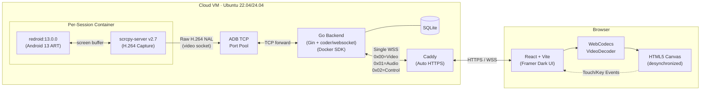
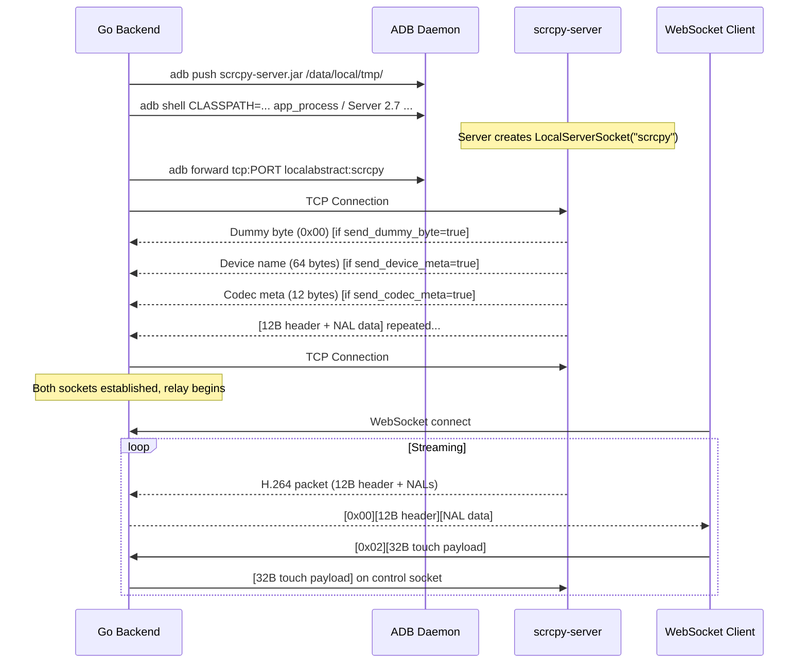
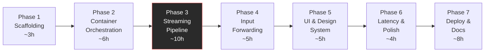

# Implementation Plan: HealthTick Real-Time Android Browser Streaming

## Goal Description

Build a full-stack web application that streams a live, interactive Android device to a browser within a 72-hour deadline. Users open a public HTTPS URL, see a real Android 13 screen updating in real-time via WebCodecs `VideoDecoder`, and interact with it using mouse/touch and keyboard. Each user gets an isolated, ephemeral `redroid` container orchestrated by a Go backend following Clean Architecture.

### What We're Building



### Requirements Coverage Matrix

| Requirement | Priority | Phase | How It's Met |
|:---|:---:|:---:|:---|
| CR-1: Continuous real-time screen | **Must** | 3 | scrcpy H.264 → WS relay → WebCodecs VideoDecoder → Canvas |
| CR-2: Interactive input forwarding | **Must** | 4 | getBoundingClientRect normalization → binary control msgs → scrcpy |
| CR-3: Latency measurement | **Must** | 6 | Visual Loopback test (ms clock app vs browser frame) + latency HUD |
| CR-4: Reproducible single-machine | **Must** | 1,7 | docker-compose.yml + setup-vm.sh + README |
| CR-5: Public deployed link | **Must** | 7 | Cloud VM + Caddy auto-HTTPS |
| BR-1: Isolated instance per user | **Bonus** | 2 | Per-session redroid container via Docker SDK |
| BR-2: On-demand lifecycle | **Bonus** | 2 | Create on POST, destroy on disconnect/idle |

---

## Resolved Technical Decisions

| Decision | Resolution | Rationale |
|:---|:---|:---|
| Backend language | **Go 1.22+** | Single binary, low memory, fast `os/exec` for ADB, efficient byte streaming |
| Frontend framework | **React + Vite + TypeScript + Tailwind** | Fast HMR, simple SPA (no SSR needed for streaming canvas) |
| Design system | **Framer-inspired dark canvas** per `DESIGN.md` | Dark-only, Inter Variable body, Mona Sans display |
| Android runtime | **`redroid/redroid:13.0.0-latest`** | Real AOSP ART, no QEMU overhead, sub-5s cold boot, GPL-3.0 |
| Screen capture | **scrcpy-server v2.7** | Zero-transcode H.264 Baseline NAL forwarding |
| WebSocket lib | **`github.com/coder/websocket`** | Pure Go, formerly nhooyr/websocket, well-maintained |
| HTTP framework | **Gin** | Matches GO-BACKEND-BEST-PRACTICES.md reference architecture |
| Container SDK | **Go Docker SDK** (`github.com/docker/docker/client`) | Native Go, full container lifecycle control |
| Docker networking | **Bridge mode** + dynamic port map (`-p HOST:5555`) | Avoids port collision with host networking |
| Ephemeral storage | **`--rm` + `AutoRemove: true`** | Container auto-deletes on stop, zero state leakage |
| TLS termination | **Caddy** with auto Let's Encrypt | Zero-config HTTPS, required for WebCodecs Secure Context |
| Persistence | **SQLite** via `modernc.org/sqlite` (pure Go, no CGO) | Lightweight session metadata, no heavy DB cluster |
| Audio | **Out of scope** | Optional stretch; focus on sub-50ms video + touch |
| WS multiplexing | **1-byte channel prefix** (`0x00`=Video, `0x02`=Control) | Matches scrcpy architecture, single port per session |

---

## Research Findings: Protocol Specifications

### scrcpy-server v2.7 Connection Flow



#### scrcpy-server Launch Command
```bash
adb shell CLASSPATH=/data/local/tmp/scrcpy-server.jar \
    app_process / com.genymobile.scrcpy.Server 2.7 \
    tunnel_forward=true \
    video=true \
    audio=false \
    control=true \
    video_codec=h264 \
    max_size=1080 \
    max_fps=60 \
    video_bit_rate=8000000 \
    send_device_meta=false \
    send_dummy_byte=false \
    send_codec_meta=false
```

> [!NOTE]
> We disable `send_device_meta`, `send_dummy_byte`, and `send_codec_meta` to simplify the Go relay — the video socket immediately outputs raw H.264 packets with no handshake preamble. Device dimensions are known from the container config (1080×1920).

#### Video Socket Packet Format (12-byte header + payload)

```
┌────────────────────────────────────────────┐
│          pts_and_flags (8 bytes BE)        │
│  Bit 63: PACKET_FLAG_CONFIG (SPS/PPS)     │
│  Bit 62: PACKET_FLAG_KEY_FRAME (IDR)      │
│  Bits 0-61: PTS in microseconds           │
├────────────────────────────────────────────┤
│          packet_size (4 bytes BE)          │
├────────────────────────────────────────────┤
│          NAL data (packet_size bytes)      │
│   Raw H.264 Annex B (with start codes)    │
└────────────────────────────────────────────┘
```

**Keyframe detection** (zero-CPU method): Check `pts_and_flags & (1 << 62)` — no NAL parsing needed.

---

### Control Messages (Client → scrcpy-server)

#### INJECT_TOUCH_EVENT — 32 bytes

| Offset | Size | Field | Type | Values |
|:---|:---|:---|:---|:---|
| 0 | 1 | `type` | uint8 | `0x02` |
| 1 | 1 | `action` | uint8 | `0`=DOWN, `1`=UP, `2`=MOVE |
| 2 | 8 | `pointer_id` | int64 BE | `-1` (mouse), `-2` (finger), `0..N` (multitouch) |
| 10 | 4 | `x` | int32 BE | Pixel X on device screen |
| 14 | 4 | `y` | int32 BE | Pixel Y on device screen |
| 18 | 2 | `width` | uint16 BE | Video frame width (e.g. 1080) |
| 20 | 2 | `height` | uint16 BE | Video frame height (e.g. 1920) |
| 22 | 2 | `pressure` | uint16 BE | `0x0000`–`0xFFFF` (0.0–1.0 fixed-point) |
| 24 | 4 | `action_button` | uint32 BE | `1`=Primary, `2`=Secondary, `0`=None |
| 28 | 4 | `buttons` | uint32 BE | Currently held button bitmask |

#### INJECT_SCROLL_EVENT — 21 bytes

| Offset | Size | Field | Type | Values |
|:---|:---|:---|:---|:---|
| 0 | 1 | `type` | uint8 | `0x03` |
| 1 | 4 | `x` | int32 BE | Pointer X position |
| 5 | 4 | `y` | int32 BE | Pointer Y position |
| 9 | 2 | `width` | uint16 BE | Video frame width |
| 11 | 2 | `height` | uint16 BE | Video frame height |
| 13 | 2 | `hscroll` | **int16 BE** | Horizontal scroll (signed fixed-point) |
| 15 | 2 | `vscroll` | **int16 BE** | Vertical scroll (signed fixed-point) |
| 17 | 4 | `buttons` | uint32 BE | Currently held button bitmask |

> [!IMPORTANT]
> Scroll values are **int16** (2 bytes each), NOT int32. This makes the total **21 bytes**, not 25. Browser `wheel.deltaY` (typically ±120 per tick) must be normalized: `Math.sign(deltaY)` to get ±1 as the scroll unit.

#### INJECT_KEYCODE — 14 bytes

| Offset | Size | Field | Type |
|:---|:---|:---|:---|
| 0 | 1 | `type` | uint8 (`0x00`) |
| 1 | 1 | `action` | uint8 (`0`=DOWN, `1`=UP) |
| 2 | 4 | `keycode` | uint32 BE (Android `KEYCODE_*`) |
| 6 | 4 | `repeat` | uint32 BE |
| 10 | 4 | `metastate` | uint32 BE |

#### SET_CLIPBOARD — 14 + N bytes

| Offset | Size | Field | Type |
|:---|:---|:---|:---|
| 0 | 1 | `type` | uint8 (`0x09`) |
| 1 | 8 | `sequence` | uint64 BE |
| 9 | 1 | `paste` | uint8 (`1`=paste immediately) |
| 10 | 4 | `length` | uint32 BE |
| 14 | N | `text` | UTF-8 bytes |

---

### WebCodecs Integration Strategy

Based on research of the WebCodecs API and browser compatibility:

#### Configuration
```typescript
// Annex B mode — zero conversion overhead, feed scrcpy NALs directly
const config: VideoDecoderConfig = {
  codec: 'avc1.42e01f',  // Constrained Baseline Level 3.1 (scrcpy default)
  optimizeForLatency: true,  // Disables decoder picture reordering buffer
  hardwareAcceleration: 'prefer-hardware',
};
// No 'description' property needed — SPS/PPS are in-band in Annex B
```

> [!TIP]
> **Dynamic codec string**: Extract profile/compat/level from SPS NAL bytes 1-3:
> `avc1.${sps[1].hex}${sps[2].hex}${sps[3].hex}` — e.g. `avc1.42e01f`

#### Rendering Strategy: Latest-Frame-Wins

```
Decoder output callback     →  Store frame in pendingFrame ref
requestAnimationFrame loop  →  Draw pendingFrame, close it

If 3 frames arrive between renders, only the latest is drawn.
Old frames are closed immediately to release GPU surfaces.
```

> [!WARNING]
> **GPU surface exhaustion**: `VideoFrame.close()` is **mandatory**. Browsers allocate 16–32 hardware surfaces. Failing to close causes the decoder to stall within ~300ms.

#### Canvas Setup
```typescript
canvas.getContext('2d', { alpha: false, desynchronized: true });
// desynchronized: true bypasses OS compositor queue, saving ~16ms (one frame)
```

#### Backpressure Management
```
if (decoder.decodeQueueSize > 5) {
  // Client falling behind — drop delta frames, wait for keyframe
  waitingForKeyframe = true;
  return;
}
```

#### Browser Compatibility

| Browser | Version | H.264 WebCodecs |
|:---|:---|:---|
| Chrome / Edge | 94+ | ✅ Full (Annex B + avcC) |
| Safari | 16.4+ | ✅ (VideoToolbox HW accel) |
| Firefox | 130+ | ✅ (Sept 2024+) |
| Firefox Android | — | ❌ Not supported |

---

### Redroid Container Specifications

Based on research of redroid documentation and cloud VM compatibility:

#### Kernel Module Setup

**Ubuntu 22.04** (kernel 5.15):
```bash
sudo apt install -y linux-modules-extra-$(uname -r)
sudo modprobe binder_linux devices="binder,hwbinder,vndbinder"
sudo modprobe ashmem_linux  # Still available on 5.15
```

**Ubuntu 24.04** (kernel 6.8):
```bash
sudo apt install -y linux-modules-extra-$(uname -r)
sudo modprobe binder_linux devices="binder,hwbinder,vndbinder"
# ashmem_linux is REMOVED in kernel 5.18+ — use memfd instead:
# Pass androidboot.use_memfd=1 to container
```

#### Container Launch (Bridge Networking)
```bash
docker run -itd --rm --privileged \
    -p 127.0.0.1:5555:5555 \
    redroid/redroid:13.0.0-latest \
    androidboot.redroid_width=1080 \
    androidboot.redroid_height=1920 \
    androidboot.redroid_dpi=420 \
    androidboot.redroid_fps=60 \
    androidboot.redroid_gpu_mode=guest \
    androidboot.use_memfd=1 \
    ro.setupwizard.mode=DISABLED
```

#### Boot Timing Profile

| Milestone | Time |
|:---|:---|
| TCP port 5555 open | 3–8s |
| ADB status: `device` | 8–15s |
| `sys.boot_completed == 1` (first boot) | 30–60s |
| `sys.boot_completed == 1` (warm boot) | 10–20s |

> [!IMPORTANT]
> **Cloud VM requirements**: Must be KVM/full virtualization (not OpenVZ/LXC). Software rendering mode (`gpu_mode=guest`) works on headless VMs without GPU. Minimum 2 vCPU + 4GB RAM per container.

---

## Proposed Changes: File Structure

```
android-browser-stream/
├── backend/
│   ├── cmd/server/main.go              # Entry point, bootstrap
│   ├── domain/
│   │   ├── session.go                  # Session entity + Repository/Usecase interfaces
│   │   ├── device.go                   # ContainerConfig, DeviceInfo structs
│   │   └── errors.go                   # Domain error types + ErrorResponse DTO
│   ├── usecase/
│   │   ├── session_usecase.go          # Create/Destroy/List sessions, idle cleanup
│   │   └── stream_usecase.go           # ADB connect → scrcpy start → WS relay loop
│   ├── repository/
│   │   ├── session_repository.go       # SQLite-backed session CRUD
│   │   └── container_repository.go     # Docker SDK → domain.ContainerRepository
│   ├── api/
│   │   ├── controller/
│   │   │   ├── session_controller.go   # POST/GET/DELETE /api/sessions
│   │   │   └── stream_controller.go    # GET /api/sessions/:id/stream (WS upgrade)
│   │   ├── route/router.go             # DI wiring + Gin route registration
│   │   └── middleware/cors.go
│   ├── infrastructure/
│   │   ├── adb/client.go              # os/exec wrapper: connect, push, forward, shell
│   │   ├── scrcpy/
│   │   │   ├── server.go             # Push JAR, start process, connect sockets
│   │   │   ├── video.go              # Read 12B header + NAL data from video socket
│   │   │   └── control.go            # Write touch(32B)/scroll(21B)/key(14B) to control socket
│   │   ├── portpool/pool.go          # Thread-safe port allocator (sync.Mutex)
│   │   └── docker/client.go          # Docker SDK: Create, Start, Stop, Remove containers
│   ├── bootstrap/
│   │   ├── app.go                     # Application bootstrap + graceful shutdown
│   │   ├── database.go                # SQLite schema init
│   │   └── env.go                     # Viper env config loading
│   ├── bin/scrcpy-server              # scrcpy-server v2.7 JAR (downloaded during setup)
│   ├── Dockerfile
│   ├── go.mod
│   └── go.sum
├── frontend/
│   ├── src/
│   │   ├── main.tsx                   # React DOM entry
│   │   ├── App.tsx                    # Root component with session routing
│   │   ├── components/
│   │   │   ├── DeviceCanvas.tsx       # Canvas + WebCodecs + input capture (main viewer)
│   │   │   ├── SessionManager.tsx     # Session creation/listing dark UI
│   │   │   ├── LatencyHud.tsx         # Overlay showing measured latency
│   │   │   ├── ConnectionStatus.tsx   # WebSocket connection indicator
│   │   │   └── Layout.tsx            # App shell (nav bar, footer, dark canvas)
│   │   ├── hooks/
│   │   │   ├── useWebSocket.ts       # Binary WS connection + 1-byte channel demux
│   │   │   ├── useVideoDecoder.ts    # WebCodecs VideoDecoder lifecycle + latest-frame-wins
│   │   │   ├── useInputCapture.ts    # Mouse/touch/keyboard → binary control payloads
│   │   │   └── useSession.ts         # REST API client for session CRUD
│   │   ├── lib/
│   │   │   ├── protocol.ts           # Binary protocol constants + helpers
│   │   │   ├── nal-parser.ts         # H.264 NAL type detection + SPS extraction
│   │   │   ├── keymap.ts             # Browser KeyboardEvent.code → Android KEYCODE_*
│   │   │   └── api.ts               # fetch wrapper for /api/* endpoints
│   │   ├── types/index.ts            # Shared TypeScript interfaces
│   │   └── styles/globals.css         # Tailwind directives + Inter/Mona Sans imports
│   ├── public/
│   ├── index.html
│   ├── vite.config.ts
│   ├── tailwind.config.ts
│   ├── tsconfig.json
│   └── package.json
├── deploy/
│   ├── docker-compose.yml             # Dev: Go backend only (redroid managed by Go)
│   ├── docker-compose.prod.yml        # Prod overlay with Caddy
│   ├── Caddyfile                      # Auto-HTTPS reverse proxy
│   └── setup-vm.sh                    # Ubuntu VM provisioning (Docker, ADB, binder, Caddy, Go, Node)
├── docs/
│   ├── architecture.md                # Architecture write-up (deliverable #5)
│   ├── what-went-wrong.md             # Post-mortem (deliverable #6)
│   └── with-more-time.md              # Scaling roadmap (deliverable #7)
├── AGENTS.md
├── DESIGN.md
├── GO-BACKEND-BEST-PRACTICES.md
├── PROCESS_LOG.md
└── README.md
```

---

## Proposed Changes: Component Details

### Go Backend — Domain Layer

> Innermost layer. Only imports `context`, `time`, standard library.

#### [NEW] `domain/session.go`
- `SessionStatus` enum: `creating → ready → streaming → terminating → terminated`
- `Session` struct: ID, ContainerID, ADBPort, Status, DeviceWidth, DeviceHeight, CreatedAt, LastActiveAt
- `SessionRepository` interface: Create, GetByID, UpdateStatus, UpdateLastActive, List, Delete, GetStale
- `ContainerRepository` interface: Create, Stop, Remove, IsRunning
- `SessionUsecase` interface: CreateSession, GetSession, ListSessions, DestroySession
- `ErrorResponse` / `SuccessResponse` DTOs

#### [NEW] `domain/device.go`
- `ContainerConfig` struct: Image, ADBPort, Width, Height, DPI, FPS, GPUMode, MemoryLimit, CPULimit
- `DeviceInfo` struct: Name, Width, Height, Codec

#### [NEW] `domain/errors.go`
- Sentinel errors: `ErrSessionNotFound`, `ErrSessionLimit`, `ErrContainerBoot`, `ErrADBConnect`, `ErrScrcpyStart`, `ErrPortExhausted`

---

### Go Backend — Infrastructure Layer

> Adapters for external systems. Never imported by domain/ or usecase/.

#### [NEW] `infrastructure/portpool/pool.go`
- Thread-safe port allocator with `sync.Mutex`
- `New(startPort, count)` → `Acquire() (int, error)` → `Release(port)`
- Pool of 3 ports (5555, 5556, 5557) for max 3 concurrent sessions

#### [NEW] `infrastructure/docker/client.go`
- Wraps `github.com/docker/docker/client`
- `Create(cfg ContainerConfig)`: builds `container.Config` with redroid boot args, `HostConfig` with privileged + AutoRemove + port bindings + resource limits
- `Stop(containerID)`, `Remove(containerID)`, `IsRunning(containerID)`
- Implements `domain.ContainerRepository`

#### [NEW] `infrastructure/adb/client.go`
- Uses `os/exec` to call `adb` binary
- `Connect(host, port)`: `adb connect 127.0.0.1:PORT`
- `WaitForBoot(serial, timeout)`: polls `getprop sys.boot_completed` every 2s
- `Push(serial, localPath, remotePath)`: push scrcpy-server JAR
- `Forward(serial, localPort, abstractSocket)`: `adb forward tcp:PORT localabstract:scrcpy`
- `Shell(serial, args...)`: returns `*exec.Cmd` (non-blocking)
- `Disconnect(serial)`

#### [NEW] `infrastructure/scrcpy/server.go`
- `NewServer(adbClient, serial)` → `Start(ctx, binaryPath, videoPort)` → `Close()`
- Start flow: Push JAR → Shell start server → Forward port → Connect video socket (retry 30x, 200ms intervals) → Connect control socket
- Exposes `VideoConn()` and `ControlConn()` as `net.Conn`

#### [NEW] `infrastructure/scrcpy/video.go`
- `ReadVideoPacket(conn) → *VideoPacket`
- Reads 12-byte header: extracts PTS (bits 0-61), IsConfig (bit 63), IsKeyFrame (bit 62), packet_size
- Reads `packet_size` bytes of NAL data
- Returns `VideoPacket{PTS, IsConfig, IsKeyFrame, Data}`

#### [NEW] `infrastructure/scrcpy/control.go`
- `InjectTouch(conn, action, pointerID, x, y, screenW, screenH, pressure)` — 32 bytes
- `InjectScroll(conn, x, y, screenW, screenH, hscroll, vscroll)` — 21 bytes
- `InjectKeycode(conn, action, keycode, repeat, metaState)` — 14 bytes
- `InjectText(conn, text)` — 5 + len(text) bytes
- `SetClipboard(conn, sequence, paste, text)` — 14 + len(text) bytes
- All fields Big-Endian using `encoding/binary`

---

### Go Backend — Use Case Layer

> Pure business logic. Depends only on domain interfaces + infrastructure interfaces (via DI).

#### [NEW] `usecase/session_usecase.go`
- Implements `domain.SessionUsecase`
- `CreateSession`: Check session limit (max 3) → Acquire port → Create session record → Docker create container → Update status to ready
- `DestroySession`: Update status → Stop container → Remove container → Release port → Update status terminated
- `GetSession`, `ListSessions`: Delegates to repository
- **Idle cleanup goroutine**: Runs every 60s, finds sessions with LastActiveAt older than 5 minutes, destroys them
- Context timeout managed via `context.WithTimeout(ctx, u.timeout)` + `defer cancel()`

#### [NEW] `usecase/stream_usecase.go`
- `RelayStream(ctx, session, ws)`: The main streaming orchestration function
  1. `adb.Connect` + `adb.WaitForBoot` (up to 90s timeout)
  2. `adb.Push` scrcpy-server JAR
  3. `adb.Shell` to start scrcpy-server process
  4. `adb.Forward` TCP port to `localabstract:scrcpy`
  5. Connect video socket (TCP #1) with retry loop
  6. Connect control socket (TCP #2)
  7. Launch 2 goroutines in `sync.WaitGroup`:
     - **Video relay**: Read `VideoPacket` → prepend `0x00` channel byte → forward header+data to WebSocket
     - **Control relay**: Read binary WS message → check `channel == 0x02` → forward payload to scrcpy control socket
  8. Block until either goroutine exits (ctx cancel, WS close, socket error)
  9. On exit: close scrcpy → trigger session destroy

---

### Go Backend — API Layer

> Thin controllers. Parse request → call usecase → format response.

#### [NEW] `api/controller/session_controller.go`
- `Create(c *gin.Context)`: Call `usecase.CreateSession(c.Request.Context())`, return 201 + session JSON
- `Get(c *gin.Context)`: Call `usecase.GetSession(ctx, c.Param("id"))`, return 200/404
- `List(c *gin.Context)`: Return all sessions as JSON array
- `Delete(c *gin.Context)`: Call `usecase.DestroySession`, return 204

#### [NEW] `api/controller/stream_controller.go`
- `HandleStream(c *gin.Context)`: Get session → `websocket.Accept(c.Writer, c.Request)` → call `streamUsecase.RelayStream(ctx, session, conn)` → on return, destroy session

#### [NEW] `api/route/router.go`
- DI wiring: instantiates all infrastructure → repositories → usecases → controllers
- Routes:
  - `POST /api/sessions` → Create
  - `GET /api/sessions` → List
  - `GET /api/sessions/:id` → Get
  - `DELETE /api/sessions/:id` → Delete
  - `GET /api/sessions/:id/stream` → WebSocket upgrade
  - `GET /api/health` → Health check

#### [NEW] `api/middleware/cors.go`
- Standard CORS middleware allowing the frontend origin

---

### React Frontend

#### [NEW] `hooks/useVideoDecoder.ts`
- Creates `VideoDecoder` with Annex B config (`avc1.42e01f`, `optimizeForLatency: true`)
- Output callback: latest-frame-wins pattern via `pendingFrame` ref + `requestAnimationFrame`
- `feedPacket(data, ptsUs, isKey)`: checks `waitingForKeyframe`, monitors `decodeQueueSize > 5` for backpressure
- `init()`, `destroy()`, `reset()` lifecycle methods
- Canvas context: `{ alpha: false, desynchronized: true }`

#### [NEW] `hooks/useWebSocket.ts`
- Opens binary WebSocket to `/api/sessions/:id/stream`
- `onmessage`: reads byte 0 as channel, demuxes:
  - `0x00` (video): Parse 12-byte scrcpy header → extract PTS flags → call `onVideoPacket(data, pts, isKey, isConfig)`
  - `0x02` (control): Forward to `onControlMessage` callback
- `sendControl(payload)`: prepends `0x02` channel byte, sends as binary
- `connect(url)`, `close()` methods

#### [NEW] `hooks/useInputCapture.ts`
- Captures `mousedown/mousemove/mouseup` on canvas → `normalizeCoords` via `getBoundingClientRect()` → builds 32-byte touch payload → `sendControl()`
- Captures `wheel` events → builds 21-byte scroll payload (hscroll/vscroll as int16)
- Captures `keydown/keyup` → maps `KeyboardEvent.code` to Android `KEYCODE_*` → builds 14-byte keycode payload
- Coordinate normalization: `ratioX = (clientX - rect.left) / rect.width; x = Math.round(ratioX * deviceWidth)`
- Canvas `tabIndex = 0` for keyboard focus

#### [NEW] `hooks/useSession.ts`
- REST API client: `createSession()`, `getSession(id)`, `listSessions()`, `deleteSession(id)`
- Constructs WebSocket URL from session ID

#### [NEW] `components/DeviceCanvas.tsx`
- Composes `useVideoDecoder` + `useWebSocket` + `useInputCapture`
- Renders `<canvas>` with `max-h-[85vh]` + aspect ratio constraint
- Includes `<ConnectionStatus>` and `<LatencyHud>` overlays

#### [NEW] `components/SessionManager.tsx`
- Landing page: "Start Session" button → calls `createSession()` → navigates to stream view
- Shows active sessions list with status indicators
- Dark canvas UI with Framer design tokens

#### [NEW] `components/Layout.tsx`
- App shell: 56px sticky nav bar on `bg-canvas`, Framer-style footer
- Responsive: hamburger nav below 810px

#### [NEW] `lib/keymap.ts`
- Complete mapping of `KeyboardEvent.code` → Android `KeyEvent.KEYCODE_*`
- Covers: letters, digits, arrows, space, enter, backspace, delete, tab, escape, home, end, F1-F12

#### [NEW] `tailwind.config.ts`
- Custom theme extending Tailwind with Framer design tokens:
  - Colors: canvas, surface-1, surface-2, ink, ink-muted, accent-blue, hairline
  - Fonts: Mona Sans (display), Inter Variable (body)
  - Spacing: 5px-based scale
  - Border radius: xs through pill
  - Breakpoints: 1199px, 810px, 809px

---

### Deployment Configuration

#### [NEW] `deploy/docker-compose.yml`
- Go backend service (built from `backend/Dockerfile`)
- Mounts `/var/run/docker.sock` for Docker SDK access
- Mounts `backend/bin/` for scrcpy-server binary
- Environment: `REDROID_IMAGE`, `ADB_PORT_START`, `MAX_SESSIONS`, `SCRCPY_BIN_PATH`, `IDLE_TIMEOUT`

#### [NEW] `deploy/Caddyfile`
- Reverse proxy `localhost:8080` for API + WebSocket
- Serves frontend static files from `/srv/frontend/dist`
- SPA fallback: `try_files {path} /index.html`
- Auto-HTTPS via Let's Encrypt when domain is configured

#### [NEW] `deploy/setup-vm.sh`
- Installs: Docker, ADB (`android-tools-adb`), kernel modules (`binder_linux`), Caddy, Go 1.22+, Node.js 20
- Loads `binder_linux` with `devices="binder,hwbinder,vndbinder"`
- On Ubuntu 24.04: skips `ashmem_linux`, relies on `use_memfd=1`
- Pulls `redroid/redroid:13.0.0-latest`
- Persists modules across reboots via `/etc/modules`

---

## Implementation Phases & Timeline



### Phase 1: Project Scaffolding (~3h)
- [ ] Go module init (`go mod init`)
- [ ] Create full directory structure
- [ ] Gin HTTP server with `/api/health` endpoint
- [ ] React + Vite + TypeScript + Tailwind project setup
- [ ] Tailwind config with Framer design tokens
- [ ] Docker Compose for dev environment
- [ ] Download scrcpy-server v2.7 JAR from GitHub releases
- [ ] Environment config via Viper

### Phase 2: Container Orchestration (~6h) → BR-1 + BR-2
- [ ] `infrastructure/portpool` — port allocation
- [ ] `infrastructure/docker` — Docker SDK wrapper
- [ ] `domain/session.go` — entity + interfaces
- [ ] `repository/session_repository.go` — SQLite CRUD
- [ ] `usecase/session_usecase.go` — session lifecycle + idle cleanup goroutine
- [ ] `api/controller/session_controller.go` — REST endpoints
- [ ] `api/route/router.go` — DI wiring
- [ ] **Test**: `POST /api/sessions` creates a redroid container, `DELETE` destroys it

### Phase 3: Streaming Pipeline (~10h) → CR-1 ⚠️ Hardest Phase
- [ ] `infrastructure/adb/client.go` — ADB command wrapper
- [ ] `infrastructure/scrcpy/server.go` — scrcpy lifecycle
- [ ] `infrastructure/scrcpy/video.go` — H.264 packet reader
- [ ] `infrastructure/scrcpy/control.go` — control message writer
- [ ] `usecase/stream_usecase.go` — bidirectional relay
- [ ] `api/controller/stream_controller.go` — WebSocket upgrade
- [ ] `hooks/useWebSocket.ts` — binary WS + demux
- [ ] `hooks/useVideoDecoder.ts` — WebCodecs + canvas render
- [ ] `components/DeviceCanvas.tsx` — compose hooks
- [ ] **Test**: Open browser → see live Android home screen updating

### Phase 4: Input Forwarding (~5h) → CR-2
- [ ] `hooks/useInputCapture.ts` — mouse/touch/keyboard/scroll
- [ ] `lib/keymap.ts` — KeyboardEvent.code → Android KEYCODE
- [ ] `lib/protocol.ts` — binary payload builders
- [ ] Coordinate normalization via `getBoundingClientRect()`
- [ ] **Test**: Click on Android elements → correct interaction; type in search bar → text appears; scroll → page scrolls

### Phase 5: UI & Design System (~5h)
- [ ] Framer dark theme implementation (colors, typography, spacing)
- [ ] Inter Variable + Mona Sans font loading
- [ ] `SessionManager.tsx` — session creation landing page
- [ ] `Layout.tsx` — app shell with nav/footer
- [ ] `ConnectionStatus.tsx` — WS state indicator
- [ ] Responsive layout (810px breakpoint)
- [ ] **Test**: UI looks polished, responsive, matches Framer dark aesthetic

### Phase 6: Latency Measurement & Polish (~4h) → CR-3
- [ ] Install millisecond clock app on redroid (or use `date +%s%3N` in terminal)
- [ ] `LatencyHud.tsx` — frame timing overlay
- [ ] Visual loopback test: capture timestamp in Android vs browser render
- [ ] Document methodology and results in `docs/architecture.md`
- [ ] Edge cases: window resize handling, WebSocket reconnect, decoder error recovery
- [ ] **Test**: Quantitative latency number documented

### Phase 7: Deployment & Documentation (~8h) → CR-4 + CR-5
- [ ] Provision Cloud VM (4 vCPU, 8GB RAM)
- [ ] Run `setup-vm.sh`
- [ ] Configure Caddy with domain → auto HTTPS
- [ ] Deploy Go binary + frontend dist
- [ ] Verify public URL works from external network
- [ ] Write `README.md` (setup steps, feature guide, limits)
- [ ] Write `docs/architecture.md` (streaming pipeline, input injection, isolation)
- [ ] Write `docs/what-went-wrong.md` (dead ends, failures)
- [ ] Write `docs/with-more-time.md` (scaling, security)
- [ ] Record 3–5 min demo video on live deployed system
- [ ] Human vs AI decision summary section

**Total estimated: ~41h** with ~31h buffer for debugging, dead ends, and iteration.

---

## Deliverables Matrix

| # | Deliverable | Source |
|:--|:---|:---|
| 1 | Public Git repository | This repo with full commit history |
| 2 | Deployed public HTTPS link | Cloud VM + Caddy (Phase 7) |
| 3 | Narrated demo video (3–5 min) | Record on live deployment (Phase 7) |
| 4 | README.md | Setup steps, feature guide, hosting, limits (Phase 7) |
| 5 | Architecture write-up | `docs/architecture.md` (Phase 7) |
| 6 | "What Went Wrong" post-mortem | `docs/what-went-wrong.md` (Phase 7) |
| 7 | "With More Time" roadmap | `docs/with-more-time.md` (Phase 7) |
| 8 | AI audit record | `PROCESS_LOG.md` (maintained throughout) |
| 9 | Human vs AI decision summary | Section in architecture doc (Phase 7) |

---

## User Review Required

> [!IMPORTANT]
> **Cloud VM**: You need a 4-vCPU / 8GB RAM Cloud VM with **KVM/full virtualization** (not OpenVZ). Recommended: **Hetzner CX41** (~€15/mo) or **DigitalOcean Premium Droplet** ($48/mo). `setup-vm.sh` handles all software.

> [!IMPORTANT]
> **Domain Name**: Caddy needs a domain pointing to the VM IP for automatic HTTPS (e.g., `stream.yourdomain.com`). Alternative: Cloudflare Tunnel for zero-domain deployment.

> [!IMPORTANT]
> **scrcpy-server binary**: Downloaded from [scrcpy GitHub releases v2.7](https://github.com/Genymobile/scrcpy/releases/tag/v2.7) — a ~50KB JAR file. I'll download it during Phase 1 scaffolding.

---

## Open Questions

> [!IMPORTANT]
> **1. Additional bonus features?** BR-1 (isolation) and BR-2 (lifecycle) are built into the architecture. Want to attempt BR-3 (clipboard), BR-4 (kiosk), or BR-5 (recording)?

> [!IMPORTANT]
> **2. Cloud provider preference?** This affects `setup-vm.sh` and deployment scripts.

> [!IMPORTANT]
> **3. Time remaining?** How many hours remain in the 72-hour deadline?

---

## Verification Plan

### Automated Tests
```bash
# Backend: all tests with race detector
cd backend && go test -v -race ./...

# Backend: vet + format
cd backend && go vet ./... && test -z "$(gofmt -l .)"

# Frontend: TypeScript type check
cd frontend && npx tsc --noEmit

# Frontend: lint
cd frontend && npx eslint src/
```

### Manual Verification

| Requirement | Verification Steps |
|:---|:---|
| **CR-1** | Open browser → create session → Android home screen appears, animates without manual refresh |
| **CR-2** | Click Android UI → correct element activates; type text → appears in search bar; scroll → page scrolls; resize browser → coordinates still accurate |
| **CR-3** | Run clock app on Android → compare displayed time vs browser canvas timestamp → report delta in ms |
| **CR-4** | Fresh VM → `setup-vm.sh` → `docker-compose up` → stream works end-to-end |
| **CR-5** | Open `https://your-domain.com` from different network → create session → stream and input work |
| **BR-1** | Open 2 browser tabs → each gets different Android instance → actions don't cross-contaminate |
| **BR-2** | Create session → close tab → `docker ps` shows container gone → port released |
