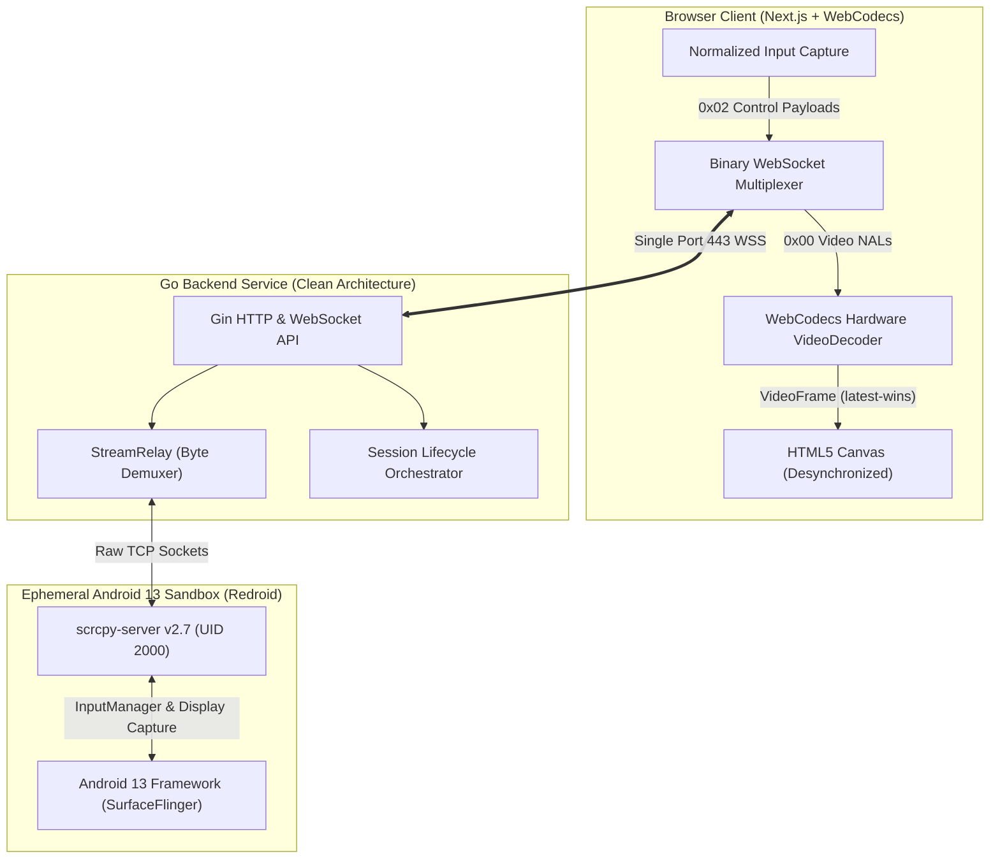

# DroidCanvas: Engineering a Sub-50ms Cloud-Native Android Streaming Engine in the Browser

Building an interactive Android-in-Cloud (AIC) streaming engine that feels indistinguishable from a physical device requires conquering three major engineering challenges: video encoding latency, unpredictable network jitter, and the heavy virtualization overhead typical of Android emulators. 

**DroidCanvas** is an open-source, ultra-low-latency streaming engine that executes ephemeral Android 13 containers and streams interactive H.264 video directly to modern web browsers. It achieves sub-50ms glass-to-glass latency with **zero server-side transcoding overhead**, relying entirely on WebCodecs, WebSockets, and Clean Architecture.

This comprehensive technical deep dive explores the system's architecture, the intricacies of the zero-transcode streaming pipeline, how we deconstructed the 24ms core latency pipeline, and the war stories from building close to the metal.

  <h3>Key Takeaways</h3>
  <ul>
    <li><strong>Zero-Transcode Pipeline:</strong> Using WebCodecs and a custom Go WebSocket multiplexer eliminates server-side CPU encoding overhead, feeding scrcpy's raw H.264 Annex B NALs directly to the browser's GPU.</li>
    <li><strong>Sub-50ms Latency via Latest-Frame-Wins:</strong> By utilizing a zero-buffering, desynchronized HTML5 canvas rendering strategy, the core engine pipeline operates at an astonishing ~24ms.</li>
    <li><strong>Near-Bare-Metal Sandboxing:</strong> Redroid containers utilizing the host Linux kernel's <code>binderfs</code> IPC provide native-level performance, avoiding the 60-second cold boot times and heavy RAM taxes of QEMU emulation.</li>
    <li><strong>Single Multiplexed WebSocket:</strong> A 1-byte protocol prefix multiplexes video, control inputs (touch, 16-bit fixed-point scroll, keyboard), and microsecond latency telemetry over a single, efficient TCP connection.</li>
    <li><strong>Defense-in-Depth Kiosk Mode:</strong> A 3-tier lockdown system (Backend Input Filter, AOSP Immersive Policy, and a Go-based <code>dumpsys</code> Watchdog) guarantees users remain sandboxed within authorized applications.</li>
  </ul>

---

## Architecting for Zero-State and High Performance

At its core, DroidCanvas is built on the **Server-as-Orchestration-Hub** model. The web client is kept purely presentational; it holds no business logic regarding container orchestration. The Go backend, adhering strictly to **Clean Architecture**, handles container lifecycles, dynamic port pooling, and input validation.

### Why Redroid over QEMU?
Traditional Android emulation via QEMU or Android Studio's Emulator introduces a massive tax: nested KVM virtualization, 2.5–4GB of RAM baseline per VM, and excruciating 60-to-90-second cold boot times.

DroidCanvas instead uses **Redroid** (Android in Docker). Redroid runs headless Android 13 inside native OCI containers. Because it shares the host's Linux kernel and utilizes `/dev/binderfs` for Android IPC, it consumes only ~800MB of RAM per instance and boots in under 5 seconds. In conjunction with our pre-warmed container pool, user-perceived connection times drop to under 300ms.

---

## The Zero-Transcode Streaming Pipeline: The Heart of the System

To achieve ultra-low latency, you must ruthlessly eliminate intermediate processing steps. DroidCanvas bypasses server-side video transcoding entirely. Transcoding H.264 streams on the backend would consume ~100% of a CPU core per session and add 15-30ms of delay. 

### 1. Raw Extraction via scrcpy
We deploy `scrcpy-server v2.7` directly inside the Android container. Scrcpy hooks into Android's `SurfaceFlinger`, captures the virtual display, and encodes it into a raw **H.264 Annex B** byte stream using Android's MediaCodec API.

### 2. WebSocket Multiplexing
Traditional low-latency streaming often relies on WebRTC. However, WebRTC's dual connections (data channels + media tracks) introduce complex SDP offer/answer signaling, NAT traversal (STUN/TURN) overhead, and mandatory 20-45ms jitter buffers. 

DroidCanvas avoids this by utilizing a **single binary WebSocket connection** acting as a high-speed multiplexer, routing traffic using a strict 1-byte prefix header:
- `0x00`: Raw H.264 Video NAL Units (Annex B)
- `0x01`: Audio Stream (Opus/AAC)
- `0x02`: Binary Input & Control Messages
- `0x03`: Microsecond Latency Ping/Pong
- `0x04`: Stream Metadata (Dimensions, Codec ID)

### 3. WebCodecs & The Latest-Frame-Wins Strategy
When the `0x00` video payloads arrive in the browser, they are fed directly into the **WebCodecs API** (`VideoDecoder`). WebCodecs bypasses the DOM entirely, executing hardware-accelerated decoding directly on the client's GPU.

In interactive streaming, displaying a stale frame is worse than dropping it. DroidCanvas implements a zero-buffering **Latest-Frame-Wins** pattern:
1. `VideoDecoder.decode(chunk)` processes the incoming NAL.
2. The output callback stores the decoded `VideoFrame` in a React reference, instantly replacing any unrendered previous frame.
3. `requestAnimationFrame` schedules canvas rendering, drawing the frame onto a context configured with `desynchronized: true` (bypassing the OS compositor queue).
4. Immediately after `ctx.drawImage()`, `frame.close()` is invoked. This explicitly releases the underlying hardware surface, eliminating memory leaks and frame accumulation.

---

## Breaking Down the 24ms Core Latency Pipeline

Glass-to-glass latency is the time elapsed between a physical user input (e.g., a mouse click) and the corresponding pixel update rendered on the screen. DroidCanvas operates at a blazing **~24ms** core engine processing speed.

<svg width="100%" height="320" viewBox="0 0 800 320" xmlns="http://www.w3.org/2000/svg" role="img" aria-labelledby="latency-chart-title" style="background: #1e1e1e; border-radius: 8px; font-family: sans-serif; margin: 20px 0;">
  <title id="latency-chart-title">Glass-to-Glass Latency Pipeline Breakdown</title>
  
  <text x="400" y="30" fill="#fff" font-size="18" font-weight="bold" text-anchor="middle">Glass-to-Glass Latency Pipeline (Local LAN vs WAN)</text>
  
  <g transform="translate(50, 60)">
    <!-- Axis -->
    <line x1="0" y1="0" x2="0" y2="200" stroke="#888" stroke-width="2"/>
    <line x1="0" y1="200" x2="700" y2="200" stroke="#888" stroke-width="2"/>
    
    <!-- LAN Bar (25ms total) -->
    <text x="-10" y="50" fill="#fff" font-size="14" text-anchor="end">LAN</text>
    <rect x="0" y="35" width="20" height="20" fill="#4ade80"/> <!-- Input 1ms -->
    <rect x="20" y="35" width="10" height="20" fill="#60a5fa"/> <!-- NetUp 0.5ms -->
    <rect x="30" y="35" width="130" height="20" fill="#a78bfa"/> <!-- Relay 6.5ms -->
    <rect x="160" y="35" width="240" height="20" fill="#fb923c"/> <!-- Encode 12ms -->
    <rect x="400" y="35" width="10" height="20" fill="#60a5fa"/> <!-- NetDown 0.5ms -->
    <rect x="410" y="35" width="90" height="20" fill="#f472b6"/> <!-- Decode 4.5ms -->
    <text x="510" y="50" fill="#4ade80" font-size="14" font-weight="bold">~25ms</text>

    <!-- WAN Bar (162ms total - represented truncated for visual fit) -->
    <text x="-10" y="90" fill="#fff" font-size="14" text-anchor="end">Cloud WAN</text>
    <rect x="0" y="75" width="20" height="20" fill="#4ade80"/> <!-- Input 1ms -->
    <rect x="20" y="75" width="140" height="20" fill="#60a5fa"/> <!-- NetUp 68ms -->
    <rect x="160" y="75" width="130" height="20" fill="#a78bfa"/> <!-- Relay 6.5ms -->
    <rect x="290" y="75" width="240" height="20" fill="#fb923c"/> <!-- Encode 12ms -->
    <rect x="530" y="75" width="140" height="20" fill="#60a5fa"/> <!-- NetDown 68ms -->
    <rect x="670" y="75" width="20" height="20" fill="#f472b6"/> <!-- Decode 4.5ms (cut off) -->
    <text x="700" y="90" fill="#fb923c" font-size="14" font-weight="bold">~162ms</text>
    
    <!-- Legend -->
    <g transform="translate(0, 140)">
      <rect x="0" y="0" width="15" height="15" fill="#4ade80"/><text x="25" y="12" fill="#fff" font-size="12">Browser Input Capture (1ms)</text>
      <rect x="220" y="0" width="15" height="15" fill="#60a5fa"/><text x="245" y="12" fill="#fff" font-size="12">WebSocket Transit</text>
      <rect x="420" y="0" width="15" height="15" fill="#a78bfa"/><text x="445" y="12" fill="#fff" font-size="12">OS Dispatch (6.5ms)</text>
      <rect x="0" y="25" width="15" height="15" fill="#fb923c"/><text x="25" y="37" fill="#fff" font-size="12">H.264 Capture & Encode (12ms)</text>
      <rect x="220" y="25" width="15" height="15" fill="#f472b6"/><text x="245" y="37" fill="#fff" font-size="12">GPU Decode & Paint (4.5ms)</text>
    </g>
  </g>
</svg>

### The 8-Stage Execution Pipeline
1. **$T_1$ Input Capture (1.0 ms):** The browser's DOM normalizes mouse/touch coordinates into a 32-byte binary payload.
2. **$T_2$ Upstream Transport (0.5–68 ms):** The payload traverses the WebSocket to the Go backend.
3. **$T_3$ Backend Demux & Dispatch (0.5 ms):** Go multiplexer routes the payload to the scrcpy TCP control socket.
4. **$T_4$ Android IPC Dispatch (6.0 ms):** Scrcpy uses reflection to inject the event directly into Android's `InputManager`.
5. **$T_5$ Frame Composition & Encode (12.0 ms):** Android's `SurfaceFlinger` updates the view state, and the MediaCodec pipeline generates a new H.264 NAL.
6. **$T_6$ Downstream Transport (0.5–68 ms):** The NAL traverses the network back to the client.
7. **$T_7$ WebCodecs Decode (3.5 ms):** The browser GPU decodes the `avc1` slice.
8. **$T_8$ Canvas Paint (1.0 ms):** `ctx.drawImage` renders the frame.

*Note on Geography:* In a production WAN deployment (e.g., reaching an Azure VM in Japan from a remote continent), network transit ($T_2$ and $T_6$) adds ~130ms of unavoidable speed-of-light delay. The core computational pipeline, however, remains strictly bounded at ~24ms.

---

## Bidirectional Control and Kiosk Sandboxing

Input forwarding isn't just about sending clicks; it requires meticulous normalization and security bounding.

### Normalizing Coordinates and Fixed-Point Scrolling
Because the HTML5 Canvas scales responsively to fit the user's browser, client coordinates must be mapped precisely to the Android 1080x1920 logical resolution, compensating for letterboxing or pillarboxing.
Furthermore, modern mouse wheel scrolling relies on a specific fixed-point math implementation. In the scrcpy protocol, scrolling utilizes **16-bit signed fixed-point integers (`i16fp`)**, where 1.0 scroll unit equals exactly `2048`. Sending raw integers causes Android's `InputManager` to calculate sub-pixel floats and round them down to zero, breaking scrolling entirely. DroidCanvas accurately scales `Math.round(deltaY * 2048)` to guarantee native, fluid list scrolling.

### The 3-Tier Defense-in-Depth Kiosk Mode
For enterprise security, users must be locked into a specific application (e.g., AOSP DeskClock) with no ability to reach system settings. We implemented a 3-tier lockdown:
1. **Tier 1: Go Backend Input Filter.** The Go relay parses incoming `0x02` control packets. It explicitly drops unpermitted keys (`KEYCODE_HOME`, `KEYCODE_POWER`, `KEYCODE_APP_SWITCH`) and actively clamps touch coordinates attempting to pull down the top status bar or trigger bottom-edge navigation gestures.
2. **Tier 2: AOSP Immersive Policy.** The container boot script forces global immersive mode (`settings put global policy_control immersive.full=*`), hiding the navigation and status bars at the OS level.
3. **Tier 3: The Dumpsys Watchdog.** A background Go goroutine polls `dumpsys activity activities` every 750ms. If the resumed foreground package deviates from the authorized app, the watchdog instantly issues an `am force-stop` on the rogue package and relaunches the intended application.

---

## Post-Mortem: War Stories from the Trenches

Building close to the metal inevitably exposes complex edge cases. Here are three critical bugs we resolved during development:

### 1. The Async Microtask & The Dropped Keyframe
**The Problem:** The stream would connect, log the codec profile, but the canvas remained completely blank. 
**The Cause:** Scrcpy sends a standalone configuration packet (SPS/PPS) immediately followed by the first IDR Keyframe. Initially, `configureDecoder()` was an `async` function. JavaScript deferred its execution to an asynchronous microtask. In that microsecond window, the IDR Keyframe arrived, failed the (still pending) configuration check, and was silently dropped. Without that initial keyframe, all subsequent delta frames were unrenderable.
**The Fix:** Rewriting decoder initialization to be strictly synchronous ensured the state machine was ready on the exact same event loop tick, capturing the keyframe perfectly.

### 2. The LinuxKit Binder IPC Signal 129
**The Problem:** Running the stack on Docker Desktop for Linux caused the Redroid container to crash instantly with `Exited (129)`.
**The Cause:** Docker Desktop for Linux runs inside an isolated `LinuxKit` QEMU VM. Redroid, unlike an emulator, relies heavily on the host kernel's Android **Binder IPC driver** (`/dev/binderfs`) to communicate between Android's `init`, `SurfaceFlinger`, and `Zygote`. LinuxKit does not compile `CONFIG_ANDROID_BINDER_IPC`. When Redroid booted and couldn't find the binder interface, Android kernel initialization aborted.
**The Fix:** We migrated the deployment architecture to native `docker-ce` directly on the Ubuntu host, manually mounting `binderfs` and provisioning the `/dev/binder` symlinks to grant the containers native IPC access.

### 3. SQLite Lock Contention from High-Frequency Tracking
**The Problem:** The system tracked user activity to reap abandoned sessions. Tracking every pointer drag event resulted in 60-120 SQL `UPDATE` statements per second, triggering severe `database is locked` contention errors in SQLite.
**The Cause:** SQLite utilizes database-level locking for writes. Multiple concurrent high-activity streaming sessions completely saturated the write lock.
**The Fix:** We implemented a debounced background goroutine inside the `StreamRelay` that throttled SQL activity updates to at most once every 5 seconds per session, entirely eliminating lock contention while maintaining accurate idle timeouts.

---

## Multimedia Deep Dives

To see DroidCanvas in action or to listen to an architectural discussion on how we built the zero-transcode pipeline, check out our included multimedia resources:

- 🎬 **Video Demonstration & Walkthrough:** Watch the system achieve sub-50ms latency in real-time.  
  [Watch `DroidCanvas__Sub-50ms_Stream.mp4`](./video/DroidCanvas__Sub-50ms_Stream.mp4)
- 🎧 **Audio Architectural Overview:** Listen to an in-depth discussion on our engineering trade-offs.  
  [Listen to `Streaming_Android_to_Browsers_Under_50ms.m4a`](./audio/Streaming_Android_to_Browsers_Under_50ms.m4a)

---

## Conclusion

**DroidCanvas** proves that modern web browsers, armed with the WebCodecs API and binary WebSockets, are more than capable of replacing thick native clients for ultra-low-latency streaming tasks. By pairing this with ephemeral, kernel-sharing Android containers like Redroid and orchestrating it all through a resilient Go backend, developers can deliver near-bare-metal mobile experiences instantaneously via a simple URL.

For a deeper look into the byte-level multiplexing, desynchronized canvas rendering, and the Go orchestration layer, explore the [open-source repository in our documentation](/mnt/Projects/android-browser-stream/docs).
