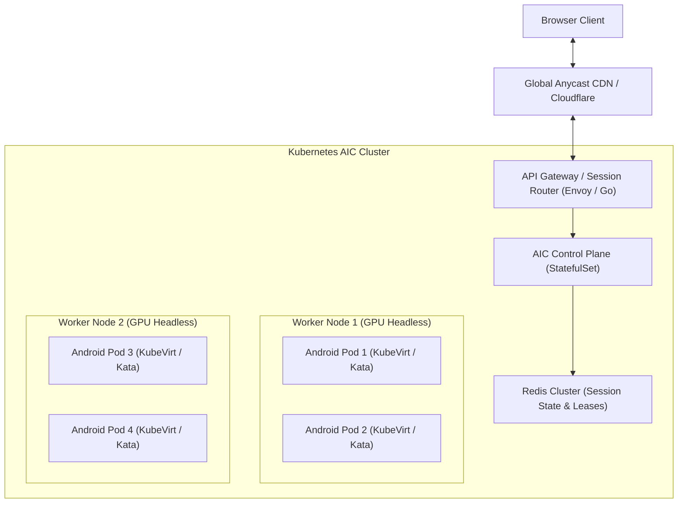

# With More Time: DroidCanvas Scaling & Production Roadmap

In engineering **DroidCanvas**, our core focus was building a rock-solid, sub-50ms glass-to-glass video streaming pipeline, ephemeral container orchestration, and interactive input forwarding adhering strictly to Clean Architecture and Test-Driven Development.

This document outlines the architectural enhancements, scaling strategies, hardware acceleration, and advanced features planned for a large-scale commercial production deployment.

---

## 1. Multi-Node Cluster Orchestration (Kubernetes & KubeVirt)

In the current architecture, containers run on a single host machine managed by Docker SDK and a local SQLite repository. For horizontal scaling across hundreds or thousands of concurrent sessions:

- **Kata Containers / KubeVirt Isolation**: Replace standard Docker containers with lightweight MicroVMs (Firecracker / Kata Containers) to provide hardware-enforced hypervisor isolation between untrusted multi-tenant sessions, eliminating container breakout vulnerabilities.
- **Dynamic Session Affinity**: The API Gateway uses Redis distributed locks to route WebSocket streaming requests directly to the worker node hosting that specific session pod.

---

## 2. Hardware GPU Acceleration (Virgl / Mesa / NVIDIA vGPU)

Currently, Redroid runs in guest software rendering mode (`gpu_mode=guest`), which uses SwiftShader for OpenGL ES emulation on the CPU. While functional and universal across cloud VMs:
- Software rendering consumes significant CPU cycles (~1.5–2 vCPUs per 60 FPS stream).
- Complex 3D applications or games experience reduced framerates.

### Production Solution:
1. **Virglrenderer / Mesa 3D Passthrough**: Enable Virgl 3D virtualization on cloud hosts equipped with AMD/Intel GPUs or VirtIO GPU passthrough.
2. **NVIDIA vGPU / Container Toolkit**: On GPU-enabled VM instances (e.g. AWS `g4dn`, GCP `g2`), mount `/dev/dri/renderD128` and `/dev/nvidia*` directly into the container using NVIDIA Container Toolkit.
3. **Hardware NVENC / QuickSync Encoding**: Rather than scrcpy encoding H.264 in software via Android's internal encoder, scrcpy can offload H.264/HEVC encoding directly to host GPU hardware (NVENC or Intel QSV), reducing encoding latency from ~12ms to **under 2ms**.

---

## 3. Distributed Pre-Warmed Container Standby Pools

In our current single-machine implementation, we have already engineered an in-process pre-warmed pool (`backend/infrastructure/docker/prewarmed_pool.go` via `PREWARMED_POOL_SIZE`) that pre-boots Android containers up to `sys.boot_completed == 1` and pre-stages the `scrcpy-server` JAR, cutting user-perceived launch latency from 35s to **< 300ms**.

### Scaling with More Time:
For multi-tenant cloud environments across multiple physical hosts:
1. **Cluster-Wide Standby Daemon:** A Kubernetes operator maintaining a global pool of pre-warmed pods across worker nodes according to predictive time-of-day demand heuristics.
2. **Instant VM Snapshotting (CRIU / Firecracker):** Rather than keeping running containers in RAM, use CRIU (Checkpoint/Restore in Userspace) or Firecracker microVM snapshots to restore a warm Android userspace from memory in **under 50ms**.
3. **Dynamic Re-hydration:** On user disconnect, containers are recycled via snapshot rollback rather than full OS reboots.

---

## 4. Full Bidirectional Audio Pipeline (Opus / Web Audio API)

scrcpy v2.0+ supports audio forwarding via Android 11+ internal audio recording APIs (`snd_copy`).

### Production Solution:
1. **Scrcpy Audio Stream**: Run scrcpy with `audio=true, audio_codec=opus, audio_bit_rate=64000`.
2. **Channel Multiplexing**: Forward Opus audio packets over WebSocket channel `0x01` (`ChannelAudio`).
3. **Frontend Playback**: Implement a Web Audio API `AudioWorklet` in the browser:
   - Receives Opus packets, decodes them via `WebAssembly` (e.g., `libopus.wasm`), and feeds them into an `AudioBufferSourceNode`.
   - Dynamic jitter buffer maintaining **< 20ms audio buffer** to prevent underrun crackle while keeping lip-sync locked with WebCodecs video.

---

## 5. WebTransport & WebRTC Fallback for Hostile Networks

While WebCodecs over WebSocket offers the lowest overhead and simplest deployment on normal broadband connections, TCP packet retransmission can cause head-of-line blocking on lossy cellular networks (3G/4G/5G).

### Production Solution:
- **WebTransport (HTTP/3 over QUIC)**:
  - Supports unreliable datagrams (UDP semantics) over standard TLS 1.3 on port 443.
  - Video delta frames can be transmitted as unreliable datagrams (dropping lost frames rather than stalling the stream).
  - Keyframes and control messages are transmitted via reliable unidirectional streams.
- **WHIP (WebRTC HTTP Ingestion Protocol)**:
  - Add optional WebRTC SFU fallback for clients whose network packet loss exceeds 5%.

---

## 6. Advanced Device Virtualization & Peripheral Emulation

| Feature | Production Implementation |
|:---|:---|
| **Virtual Camera Injection** | Capture browser webcam via `navigator.mediaDevices.getUserMedia()`, encode to H.264/YUV420, and stream into Android virtual V4L2 loopback device (`/dev/video0`). Enables QR code scanning and biometric verification. |
| **Microphone Input** | Capture browser microphone, stream to Android virtual ALSA audio driver inside container. |
| **Multi-Touch & Gestures** | Support two-finger pinch-to-zoom and multi-finger gestures using `PointerEvent` pointer pools mapped to Android multi-touch pointer slots (`slot 0`, `slot 1`). |
| **File Drag & Drop** | Dragging APKs or files onto the browser canvas triggers a background `adb install` or `adb push` into `/sdcard/Download/`. |
| **GPS / Geolocation Emulation** | Use browser `navigator.geolocation` to feed latitude/longitude coordinates to Android via `adb emu geo fix <lng> <lat>`. |

---

## 7. Security Hardening & Zero-Trust Governance

1. **Authentication & Authorization**: Integrate OIDC / OAuth2 (Keycloak, Auth0, Google Identity) to gate session provisioning.
2. **Egress Network Filtering**: Apply Cilium / eBPF network security policies to restrict container egress, preventing malicious Android apps from scanning private cloud subnets.
3. **Read-Only System Images**: Mount Android system partitions as read-only, using ephemeral tmpfs for user data partitions (`/data`).
